# Panel Map

> Auto-generated from `src/route-registry-core.ts`
> Each section represents a `NavSection` from `CORE_SECTIONS`.
> Node colors correspond to the `color` field of each route item.

```mermaid
flowchart TD
    subgraph section-dashboard["Dashboard"]
        dashboard["Overview"]
        analytics["Analytics"]
        pricing["Economics"]
        budget["Budget"]
        cost-analytics["Cost Analytics"]
        cost-optimization["Cost Optimization"]
        custom-metrics["Custom Metrics"]
        budget-alerts["Budget Alerts"]
        key-usage-analytics["Key Usage Analytics"]
        routing["Routing Ai"]
        contribution-graph["Contribution Graph"]
    end

    subgraph section-chat["Chat"]
        chat["Chat"]
        chat-sessions["Chat Sessions"]
        session-hub["Session Hub"]
        bookmarks["Bookmarks"]
        tasks["Tasks"]
        files["Files"]
    end

    subgraph section-debates["Debates"]
        debate["Debate Arena"]
        builder["Builder"]
        debate-live["Debate Live"]
        debate-workspace["Debate Rooms"]
        debate-replay["Debate Replay"]
        debate-tournament["Tournament"]
        audience["Audience"]
        argument-graph["Argument Graph"]
        strategy-builder["Strategy Builder"]
        debate-analysis["Debate Analysis"]
        debate-history["Debate History"]
        debates-manager["Debates Manager"]
        topics["Topics"]
        debate-templates["Debate Templates"]
        debate-quality["Debate Quality"]
        quality-impact["Quality Impact"]
        steelman["Steelman"]
        bayesian-judge["Bayesian Judge"]
        blind-eval["Blind Eval"]
        credibility["Credibility"]
        calibration["Calibration"]
        consistency["Consistency"]
        frame-tracker["Frame Tracker"]
        stance-drift["Stance Drift"]
        insight-bus["Insight Bus"]
        entanglement["Entanglement"]
        anchoring["Anchoring"]
        meta-agent["Meta Agent"]
        outcome-forecaster["Outcome Forecaster"]
        concept-blender["Concept Blender"]
        belief-mining["Belief Mining"]
        minimax-planner["Minimax Planner"]
        expert-witness["Expert Witness"]
        rhetoric["Rhetoric"]
        bias-profiler["Bias Profiler"]
        incentive-detector["Incentive Detector"]
        stakeholder["Stakeholder"]
        scratchpad["Scratchpad"]
        persona-mixer["Persona Mixer"]
        bop-tracker["Bop Tracker"]
        got-deliberation["Got Deliberation"]
        similarity["Similarity"]
        drift-detector["Drift Detector"]
        shadow-opponent["Shadow Opponent"]
        adversarial-source["Adversarial Source"]
        vuln-targeting["Vuln Targeting"]
        justification["Justification"]
        logical-form["Logical Form"]
    end

    style dashboard fill:#3b82f6,color:#fff
    style analytics fill:#8b5cf6,color:#fff
    style pricing fill:#10b981,color:#fff
    style budget fill:#10b981,color:#fff
    style cost-analytics fill:#10b981,color:#fff
    style cost-optimization fill:#f59e0b,color:#fff
    style custom-metrics fill:#8b5cf6,color:#fff
    style budget-alerts fill:#f97316,color:#fff
    style key-usage-analytics fill:#8b5cf6,color:#fff
    style routing fill:#8b5cf6,color:#fff
    style contribution-graph fill:#10b981,color:#fff

    style chat fill:#10b981,color:#fff
    style chat-sessions fill:#06b6d4,color:#fff
    style session-hub fill:#8b5cf6,color:#fff
    style bookmarks fill:#f59e0b,color:#fff
    style tasks fill:#f59e0b,color:#fff
    style files fill:#a855f7,color:#fff

    style debate fill:#a855f7,color:#fff
    style builder fill:#f59e0b,color:#fff
    style debate-live fill:#ef4444,color:#fff
    style debate-workspace fill:#8b5cf6,color:#fff
    style debate-replay fill:#6b7280,color:#fff
    style debate-tournament fill:#f97316,color:#fff
    style audience fill:#ec4899,color:#fff
    style argument-graph fill:#8b5cf6,color:#fff
    style strategy-builder fill:#06b6d4,color:#fff
    style debate-analysis fill:#a855f7,color:#fff
    style debate-history fill:#6b7280,color:#fff
    style debates-manager fill:#8b5cf6,color:#fff
    style topics fill:#a855f7,color:#fff
    style debate-templates fill:#06b6d4,color:#fff
    style debate-quality fill:#a855f7,color:#fff
    style quality-impact fill:#06b6d4,color:#fff
    style steelman fill:#8b5cf6,color:#fff
    style bayesian-judge fill:#7c3aed,color:#fff
    style blind-eval fill:#6366f1,color:#fff
    style credibility fill:#f59e0b,color:#fff
    style calibration fill:#06b6d4,color:#fff
    style consistency fill:#a855f7,color:#fff
    style frame-tracker fill:#8b5cf6,color:#fff
    style stance-drift fill:#ef4444,color:#fff
    style insight-bus fill:#a855f7,color:#fff
    style entanglement fill:#7c3aed,color:#fff
    style anchoring fill:#f97316,color:#fff
    style meta-agent fill:#8b5cf6,color:#fff
    style outcome-forecaster fill:#06b6d4,color:#fff
    style concept-blender fill:#a855f7,color:#fff
    style belief-mining fill:#6366f1,color:#fff
    style minimax-planner fill:#f97316,color:#fff
    style expert-witness fill:#7c3aed,color:#fff
    style rhetoric fill:#ec4899,color:#fff
    style bias-profiler fill:#ef4444,color:#fff
    style incentive-detector fill:#f59e0b,color:#fff
    style stakeholder fill:#ec4899,color:#fff
    style scratchpad fill:#6366f1,color:#fff
    style persona-mixer fill:#8b5cf6,color:#fff
    style bop-tracker fill:#06b6d4,color:#fff
    style got-deliberation fill:#a855f7,color:#fff
    style similarity fill:#7c3aed,color:#fff
    style drift-detector fill:#ef4444,color:#fff
    style shadow-opponent fill:#6366f1,color:#fff
    style adversarial-source fill:#8b5cf6,color:#fff
    style vuln-targeting fill:#ef4444,color:#fff
    style justification fill:#a855f7,color:#fff
    style logical-form fill:#06b6d4,color:#fff
```

## Summary

| Section   | Panels | Key Colors                                                                                                   |
| --------- | ------ | ------------------------------------------------------------------------------------------------------------ |
| Dashboard | 11     | `#3b82f6`, `#8b5cf6`, `#10b981`, `#f59e0b`, `#f97316`                                                        |
| Chat      | 6      | `#10b981`, `#06b6d4`, `#8b5cf6`, `#f59e0b`, `#a855f7`                                                        |
| Debates   | 40     | `#a855f7`, `#8b5cf6`, `#06b6d4`, `#f59e0b`, `#ef4444`, `#f97316`, `#ec4899`, `#6b7280`, `#7c3aed`, `#6366f1` |
| **Total** | **57** |                                                                                                              |
