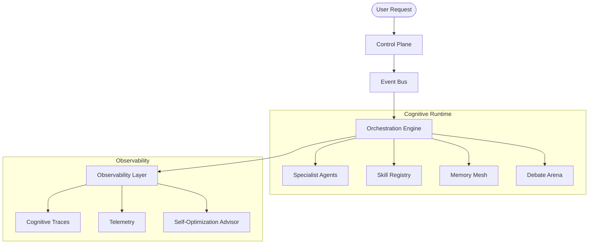

# 🪪 SuperAgents OS — Digital System Passport

> **Detailed Deep-Dive** — Identity, Architecture, Runtime Manifest  
> _For the concise quick reference, see [SYSTEM_MANIFEST.md](./SYSTEM_MANIFEST.md)._

## 1. Identity Layer

- **Name:** SuperAgents OS
- **Type:** Event-Driven Multi-Agent Intelligence Platform
- **Version:** v4.5.0 (Multi-Agent Dialectic Arena + Metrics Layer)
- **Architecture:** Decision-Centric Runtime
- **Core Paradigm:** Observable Distributed Cognition

---

## 2. System Philosophy

SuperAgents OS is not a chatbot framework. It is an **observable cognitive runtime** for distributed AI reasoning, orchestration, and decision tracing. The system treats **Decisions** as first-class runtime objects, ensuring that every thought process is interpretable, reproducible, and programmable.

---

## 3. Core Concepts

- **Agent:** An autonomous unit of specialized reasoning.
- **Decision:** The atomic unit of intelligence, capturing goals, alternatives, and causal chains.
- **Event:** The fundamental communication unit in the asynchronous system bus.
- **Cognitive Trace:** A step-by-step reconstruction of a distributed reasoning flow.
- **Intelligence DSL:** A formal language for defining cognitive topologies.
- **Debate Arena:** A dialectic environment for multi-agent consensus building.
- **Memory Mesh:** A persistent vector-like store for long-term cognitive fragments.

---

## 4. Runtime Architecture

---

## 5. Event Model

The system communicates via a central `EventBus`. Every interaction is an event:

- `id`: Unique event identifier.
- `type`: Category (e.g., `cognitive:step:active`, `tool:execution:start`).
- `source`: The producing node or service.
- `payload`: Data or state delta.
- `traceId`: Linking event to a specific cognitive cycle.

---

## 6. Decision-Centric Model (DCM)

Unlike standard LLM logs, a **Decision** object in SuperAgents OS contains:

- `input`: The prompt or trigger.
- `constraints`: Rules governing the decision (cost, latency, safety).
- `alternatives`: Different paths considered with their respective scores.
- `reasoning`: The "Why" behind the selection.
- `causal_chain`: Reference to the preceding decision that triggered this one.
- `confidence`: Semantic certainty score (0-1).

---

## 7. Cognitive Layers

1. **Execution Layer:** Agents, Tools, and low-level API adapters.
2. **Coordination Layer:** Orchestration Service and DSL Parser.
3. **Reasoning Layer:** Multi-agent debates and consensus logic.
4. **Observability Layer:** Live streams, traces, and state snapshots.
5. **Interpretation Layer:** Advisor Service and Semantic Knowledge Graph.

---

## 8. Visual Paradigms

- **Mission Control (War Room):** Unified cockpit for autonomous oversight.
- **Cognitive Microscope:** Deep analysis of individual decision logic.
- **Intelligence Builder:** Drag-and-drop Visual Programming for DSL topologies.
- **Knowledge Explorer:** Semantic graph of the system's evolving understanding.
- **Dialectic Arena:** Visual representation of the "Battle of Minds".
- **Decision Graph:** Causal visualization of trace dependencies.

---

## 9. Technology Stack

- **Frontend:** React 19.2.5 + TypeScript 6.0.2 + Framer Motion
- **Backend:** Node.js Runtime + Event-Driven Kernel
- **Communication:** Internal EventBus + WebSocket Streaming
- **Persistence:** Dexie/IndexedDB + Orama (full-text, Web Worker) + Transformers.js (real embeddings, Web Worker)
- **Testing:** Playwright (30 routes, 0 errors/warnings) + Vitest
- **DSL:** Custom JSON-based Intelligence System Specification

---

## 10. System Maturity Level

- **Core Runtime:** ✅ Stabilized
- **Observability:** ✅ Fully Active (Phase 2-3)
- **Visual Builder:** ✅ Operational (Phase 4-5)
- **Runtime Stability:** ✅ Verified (0 console errors/warnings)
- **Autonomous Optimization:** 🧪 Experimental (Phase 7)
- **Self-Healing Topologies:** 📅 Planned

---

## 11. Future Vision

To create an **observable and programmable distributed intelligence operating system** where AI is no longer a "black box" but a transparent, manageable, and self-improving infrastructure.

---

**Passport Issued by:** Antigravity (Cognitive OS Lead)  
**Date:** 2026-05-27  
**Status:** VALIDated (0 console errors, tsc --noEmit ✅, vite build ✅)
