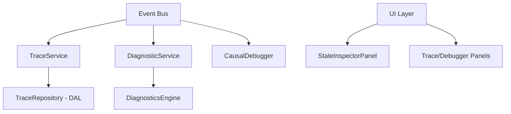

# 01_OBSERVABILITY_ARCHITECTURE.md

## Architectural Diagram (Conceptual)

The system currently exists as parallel observability flows.

## Siloed Connectivity

- **Event Bus Dependency:** VERIFIED: `src/kernel/services/trace-service.ts:30` (TraceService), `src/kernel/services/runtime-intelligence/diagnostic-service.ts:17` (DiagnosticService), `src/kernel/service-registration/phase11-causal-debugger.ts:61` (CausalDebugger) all consume the `EventBus`.
- **Data Silos:**
  - `TraceService` stores telemetry in `src/kernel/dal/trace-repository.ts` (VERIFIED).
  - `DiagnosticService` stores health/issues in internal memory/session maps (`src/kernel/services/runtime-intelligence/diagnostic-service.ts:32`).
  - `CausalDebugger` utilizes complex causal scopes and timeline storage in internal memory managed by `CausalTimelineService` (`src/kernel/service-registration/phase11-causal-debugger.ts:50`).
- **Connection Missing:** There is no shared storage contract between `TraceService` and `CausalDebugger`. While both consume `EventBus` events, they do not cross-reference trace IDs with causal IDs.

## Opinion

The current architecture is highly reactive but poorly contextualized. The system knows _that_ an event happened (via EventBus) but does not store the relationship _why_ it happened in the context of the overall system state (which the Inspector holds).
